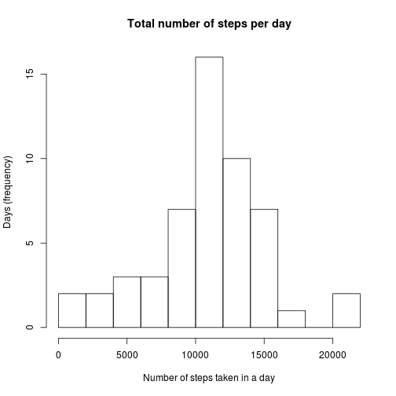
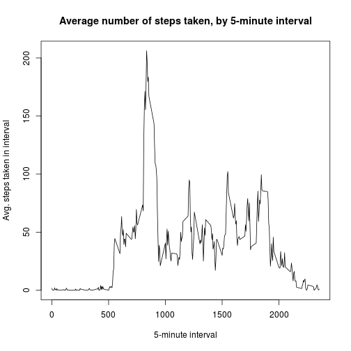
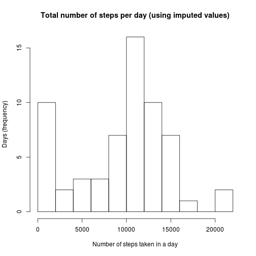
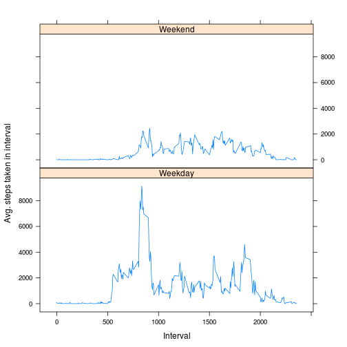

## Loading and preprocessing the data

Firstly uncompress activity.zip into its csv file and then load it into activity_data via read.csv.


```r
unzip("activity.zip", "activity.csv")
activity_data <- read.csv("activity.csv")
```


## What is mean total number of steps taken per day?

Calculate the total number of steps per day (disregarding the NA values) and create a histogram with the number of steps on the x-axis and the number of days on which this occurred (i.e. frequency) on the y-axis.


```r
steps_by_day <- aggregate(steps ~ date, data = activity_data, sum)
hist(steps_by_day$steps, breaks=10, xlab= "Number of steps taken in a day",
     ylab= "Days (frequency)", main= "Total number of steps per day")
```

 

Mean and median of the total number of steps per day can be calculated from the daily aggregated data.


```r
mean(steps_by_day$steps)
```

```
## [1] 10766.19
```


```r
median(steps_by_day$steps)
```

```
## [1] 10765
```


## What is the average daily activity pattern?

Plotting the average number of steps taken (across all days) by 5-minute time interval will show the distribution of activity across times of the day.


```r
steps_by_time_interval <- aggregate(steps ~ interval, data = activity_data, mean)
plot(steps_by_time_interval$interval, steps_by_time_interval$steps, type= "l",
     xlab="5-minute interval", ylab= "Avg. steps taken in interval",
     main= "Average number of steps taken, by 5-minute interval")
```

 

To find the 5-minute interval (averaged across all days) with the maximum number of steps:


```r
steps_by_time_interval[which.max(steps_by_time_interval$steps), ]
```

```
##     interval    steps
## 104      835 206.1698
```

## Imputing missing values

The number of intervals where there are missing values are those where the row is not "complete":


```r
sum(!complete.cases(activity_data))
```

```
## [1] 2304
```

To fill in "dummy" values in place of the NAs: replace with the mean value for the 5-minute interval across all days where it was populated (using the means per 5 minute interval summary data calculated above). Merge the activity_data with the summary table to get the mean per interval against the row, so we can replace any NAs to it.


```r
activity_data_cleaned <- merge(activity_data, steps_by_time_interval,
                               all.x = TRUE, by.x="interval", by.y="interval")
activity_data_cleaned$steps.x[is.na(activity_data_cleaned$steps.x)] <- activity_data_cleaned$steps.y
```

```
## Warning in activity_data_cleaned$steps.x[is.na(activity_data_cleaned
## $steps.x)] <- activity_data_cleaned$steps.y: number of items to replace is
## not a multiple of replacement length
```

Then test that there are no "incomplete" cases after doing the replacement.


```r
sum(!complete.cases(activity_data_cleaned[,!names(activity_data_cleaned) == "steps.y"]))
```

```
## [1] 0
```

Tidy the dataset to be equal to the original but with the NAs filled in.


```r
activity_data_cleaned$steps.y <- NULL
names(activity_data_cleaned)[names(activity_data_cleaned)=="steps.x"] <- "steps"
```

Create a new histogram of total number of steps per day, including the imputed values.


```r
steps_by_day_cleaned <- aggregate(steps ~ date, data = activity_data_cleaned, sum)
hist(steps_by_day_cleaned$steps, breaks=10, xlab= "Number of steps taken in a day",
     ylab= "Days (frequency)", main= "Total number of steps per day (using imputed values)")
```

 

Mean and median of the total number of steps per day can be calculated from the daily aggregated data, including the imputed values.


```r
mean(steps_by_day_cleaned$steps)
```

```
## [1] 9371.437
```


```r
median(steps_by_day_cleaned$steps)
```

```
## [1] 10395
```

The effect of imputing missing data is that the mean and median are both reduced, and the histogram shows that a greater number of days have a lower number of steps. It implies that the data being substituted for the missing values is not actually representative of what they should be.


## Are there differences in activity patterns between weekdays and weekends?

Create a new factor variable in the dataset (including imputed values) with levels "weekday" and "weekend" to show whether the given date is a weekday (Mon-Fri) or a weekend day (Sat-Sun).


```r
weekend <- c("Saturday", "Sunday")
activity_data_cleaned$weekday_or_weekend <-
  ifelse(weekdays(as.Date(activity_data_cleaned$date)) %in% weekend, "Weekend","Weekday")
```

Plot weekday and weekend data on a panel plot showing number of steps over time intervals for each.
First aggregate by interval and weekday/weekend then plot the resulting data.


```r
library(lattice)
steps_by_time_interval_and_weekday <- aggregate(steps ~interval+weekday_or_weekend, data=activity_data_cleaned, sum)
xyplot(steps ~ interval | weekday_or_weekend, steps_by_time_interval_and_weekday,
       type="l", layout=(c(1,2)), xlab="Interval", ylab="Avg. steps taken in interval")
```

 

The plot shows that in general the average number of steps taken per day is lower on weekend days than weekdays, but they are more evenly distributed across the time intervals. Number of steps on a weekday has a sharper 'peak' with several smaller peaks during the day, and is higher overall.
